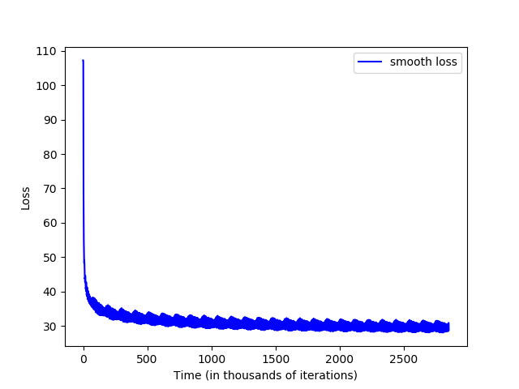
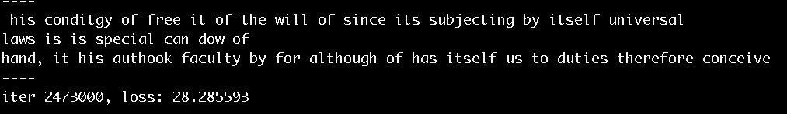

# Ethics Generator

_With Motivation of the [Pioneer.app Tournament](https://pioneer.app/)_

The aim of this project is to recreate various moral philosophers views. 
With the rise of Artificial Intelligence, the impetus to translate human values into a machine-readable format has never been more necessary.
Also, the entire codebase is open source so that others may add to this ongoing research endeavor.  
  
The first moral philosopher to be pursued will be Immanuel Kant as I've extensively studied his ethics and 
find his arguments to compelling.

My initial explorations rely on [Samir Bajaj's work](https://nlp.stanford.edu/courses/cs224n/2013/reports/bajaj.pdf)  with summarizing
Shakespeare works. 

Installation
============

This project is in Python 3 and uses [Gutenberg](https://pypi.python.org/pypi/Gutenberg) to download text data.
I use [Anaconda](https://www.anaconda.com/download/#macos) to manage Python dependencies.

    conda env create -f environment.yml
    conda activate ethics

  
Python 3
--------

This package depends on BSD-DB. The bsddb module was removed from the Python
standard library since version 2.7. This means that if we wish to use Gutenberg
on Python 3, you will need to manually install BSD-DB. 
If you're not on a Mac, go directly to the [Gutenberg](https://pypi.org/project/Gutenberg/).

On Mac, you can install BSD-DB using [homebrew](https://homebrew.sh/):

    brew install berkeley-db4
    pip install -r requirements.txt

Downloading Texts of Immanuel Kant
----------------------------------

The raw text data will go into the `texts` folder where it will be cleaned up further. 
After running this, you should have an [`ethics.txt`](http://www.gutenberg.org/ebooks/5684) 
and [`morals.txt`](http://www.gutenberg.org/ebooks/5682) for his two major works in morality. 
The initial focus will be on his Morals text or "Fundamental Principles of the Metaphysic of Morals."

    python download_kant.py

Modeling - Part 1
=================

This model is a vanilla Char-RNN that doesn't require the same level of cleaning as part 2. 

    python karpathy_test.py

After running for 3 hours or 3 Million Iterations:

  

_Think of "Loss" as how well the model works in terms of error so you want it lower.
I'd recommend running the above program for about an hour to see what phrases you get from your philosopher._ 

It created some interesting ethical claims / phrases:

It's not quite right, though... There's some obvious grammatical errors and made up words. 
Model 1 goes character-by-character so it won't pick up grammar or general sentence structure too well.
The next several models use a word-by-word and phrase-by-phrase approach that should output more meaningful claims.  

Cleaning Data
=============

The `texts/processed` folder mirrors that of [Bajaj's](https://github.com/samirbajaj-zz/cs224n-project) 
organization - ie the `processed` text file for morals has
the removal of the preface to only include Kant's words & thoughts. 

Run these commands in this order to create the full ethical `LEXICON` of Immanuel Kant.

#### lowercase all words  
    cd texts/processed && for f in `ls *.txt`; do cat $f | tr '[[:upper:]]' '[[:lower:]]' > ../lowercase/$f; done  

#### Remove punctuation.  
    cd ../lowercase && for f in `ls *.txt`; do cat $f | sed 's/[:;?!.,`*()-]/ /g' | tr "'" " " > ../remove_punct/$f ; done 

#### Move up in the directory and Remove stop words  
_If you use these scripts for other works, make sure to go into `remove_stop_words.py` to update the `book` name variable in `main()`_  
    
    cd ../.. && python remove_stop_words.py  

#### Stem Words  
    cd texts/remove_stop_words && for f in `ls *.txt`; do python ../../porter.py $f > ../stemmed/$f ; done  

#### Create LEXICON  
    cd ../.. && cat texts/stemmed/*.txt | tr ' ' '\n' | sed '/^\s+$/d' | sort | uniq -c > LEXICON
    
#### Create TFIDF Docs
    cd stemmed && for f in `ls *.txt`; do cat $f | tr ' ' '\n' | sed '/^\s+$/d' | sort | uniq -c > ../term-frequencies/$f; done

Then, delete the numbers and other symbols that aren't stemmed words in the `texts/term-frequencies/` files.  

#### Create Document Frequencies (executes but incorrect encoding)
    python df.py texts/term-frequencies/*.txt

Found issue to be with Python 2.7 `pickle.dump()` output but Python 3 is different.

Modeling - Part 2
=================

_TODO & will be done by 9/24/18_

#### PageRank

    cd texts/processed && for f in `ls *.txt`; do python ../../main.py -doc $f -tf ../term-frequencies/`echo $f | cut -d'.' -f1`.txt -df df.dat -alg pagerank > ../../summary/summary-pagerank/$f; done

#### TF-IDF

    for f in `ls *.txt`; do python ../../main.py -doc $f -tf ../term-frequencies/`echo $f | cut -d'.' -f1`.tf -df df.dat -alg tfidf > ../../summary/summary-tfidf/$f; done

Feedback
========

As I'm participating in the [Pioneer.app Tournament](https://pioneer.app/), I've received really interesting feedback on this project.

One important idea that I've received is how this project _should_ take in different cultures, genders, backgrounds etc.
As of now, I believe focusing on one text by one philosopher within one normative ethical theory to be the best path for success
within this tournament (ending at the end of September 2018). 
I think adding various viewpoints to be a serious endeavor both in terms of time and in importance.

If you'd like to explore feedback for this project, 
I encourage you to do so [here](./fellow_pioneers_feedback.md) for those who decide to train their own models
based on various philosophers from various backgrounds. 

TODO: 
-----
* `df.py` creates the wrong encoding as the original scripts were meant for py2.7 _not_ py3+
* Run Modeling - Part 2
* Add more philosophers from various backgrounds (culture, gender, race etc.)
* Replace handwritten code with libraries
* Make `remove_stop_words.py` CLI
* Keep "i.e." as these scripts remove punctuation and the lowercased stopword "i", therefore leaving a floating "e"
* Remove all `.txt` files from `texts/*` directories
